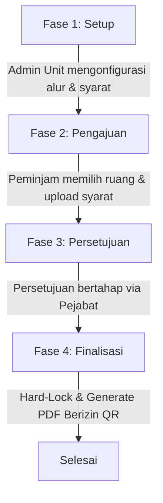

# Panduan Pengembangan Fitur & Ekstensi Sistem (Space.in)

Dokumen ini ditujukan bagi developer/pihak ketiga yang ingin memahami arsitektur **Space.in** dan melakukan pengembangan fitur baru (ekstensi) agar tetap selaras dengan desain sistem yang ada.

---

## 1. Filosofi & Konsep Utama (Workflow Engine)

**Space.in** bukan sekadar aplikasi CRUD (Create, Read, Update, Delete) biasa. Sistem ini dirancang sebagai **Workflow Engine dinamis** untuk peminjaman ruangan di Politeknik Negeri Malang (Polinema).

> [!IMPORTANT]
> **Aturan Emas:** Alur persetujuan (approval chain) dan persyaratan dokumen **tidak boleh di-hardcode** di dalam controller. Semua didefinisikan secara dinamis melalui relasi database pada tabel `workflows`, `workflow_steps`, dan `workflow_requirements`.

### 4 Peran Pengguna & Batasan Akses
1. **SuperAdmin (Pusat):**
   * Memiliki kontrol penuh atas master data global: Gedung (`buildings`) dan Ruangan (`rooms`).
   * Menentukan `unit_id` (kepemilikan/pengelola) untuk setiap ruangan.
   * Hanya SuperAdmin yang berwenang untuk melakukan `CREATE` dan `DELETE` pada gedung dan ruangan.
2. **Admin_Unit (Lokal - Jurusan/Organisasi):**
   * Mengelola unitnya sendiri dan unit turunannya (*child units*).
   * Mengatur alur persetujuan (`workflows`) dan persyaratan dokumen (`workflow_requirements`) untuk ruangan yang dikelolanya.
   * Melakukan pemblokiran jadwal internal / pemeliharaan ruangan (melalui mekanisme dummy booking).
3. **Approver (Pejabat Persetujuan):**
   * Meninjau dokumen dan menyetujui/menolak pengajuan peminjaman berdasarkan posisi jabatan (`position_id`) mereka pada alur kerja terkait.
4. **User / Peminjam (Mahasiswa/Staf):**
   * Mencari ruangan, melihat kalender ketersediaan, melakukan pengajuan, dan mengunggah dokumen persyaratan.

---

## 2. Struktur Alur Kerja (4 Fase Peminjaman)

Setiap transaksi peminjaman gedung harus melewati 4 fase berikut secara berurutan:



### Fase 1: Setup (Konfigurasi Alur)
Admin Unit menyusun rantai persetujuan dan dokumen wajib bagi unitnya.
* Aturan: 1 Ruangan hanya boleh terhubung ke maksimal 1 workflow per Unit (`workflows.room_id` dan `workflows.unit_id` bersifat unik).

### Fase 2: Pengajuan (Soft-Lock)
* Saat Peminjam memilih tanggal dan jam, sistem melakukan pengecekan konflik jadwal secara ketat.
* Jika slot kosong, sistem membuat **"Soft-Lock"** (status: `Pending` atau `Draft`) untuk mengunci slot sementara selama proses unggah berkas berlangsung agar tidak terjadi perebutan slot oleh pengguna lain (*race condition*).

### Fase 3: Persetujuan (Approver Chain)
* Transaksi booking bergerak maju dari `current_step = 1` ke step berikutnya (`current_step++`) setiap kali pejabat menyetujui.
* Jika terjadi penolakan (`Rejected`), status booking berubah menjadi `Revised`. Peminjam dapat memperbaiki dokumen dan melakukan *re-submit* tanpa mengubah ID Booking.

### Fase 4: Finalisasi (Hard-Lock & PDF)
* Ketika semua tingkat persetujuan telah memberikan status `Approved`, sistem mengubah status booking menjadi `Approved` secara permanen (**Hard-Lock**).
* Sistem secara otomatis memicu antrean (*Queue Job*) `GenerateApprovalCertificateJob` untuk menghasilkan Surat Izin Resmi berformat PDF lengkap dengan tanda tangan digital dan QR Code validasi keamanan.

---

## 3. Direktif Keamanan & Integritas Data

Saat menulis kode backend atau query baru, Anda **WAJIB** mengikuti panduan keamanan berikut:

### A. Anti-Overlap Guard (Pessimistic Locking)
Untuk mencegah *race condition* tingkat milidetik ketika dua pengguna mencoba memesan ruangan dan slot waktu yang sama persis:
* Gunakan transaksi database `DB::transaction()`.
* Gunakan pessimistic locking `lockForUpdate()` saat mengambil status booking atau ketersediaan ruangan sebelum melakukan *insert*.

*Contoh Penerapan:*
```php
use Illuminate\Support\Facades\DB;
use App\Models\Booking;

DB::transaction(function () use ($roomId, $date, $start, $end) {
    // Kunci record ruangan atau pengecekan booking yang ada dengan lockForUpdate()
    $conflict = Booking::where('room_id', $roomId)
        ->where('booking_date', $date)
        ->whereIn('status', ['Pending', 'Approved'])
        ->where(function ($query) use ($start, $end) {
            $query->where(function ($q) use ($start, $end) {
                $q->where('start_time', '<', $end)
                  ->where('end_time', '>', $start);
            });
        })
        ->lockForUpdate()
        ->exists();

    if ($conflict) {
        throw new \Exception('Ruangan sudah terbooking pada waktu tersebut!');
    }

    // Lakukan proses insert booking baru...
});
```

### B. Audit Trail & Logging Status
Setiap perubahan status peminjaman **harus dicatat** secara detail ke tabel `booking_logs` menggunakan `LoggerService`. Jangan pernah memperbarui status booking langsung tanpa mencatat lognya.

*Contoh Penerapan:*
```php
use App\Services\LoggerService;

// Setelah memperbarui status
$booking->update(['status' => 'Approved']);

// Catat ke log
LoggerService::logAction(
    bookingId: $booking->id,
    action: 'APPROVED',
    stepId: $currentStep->id,
    notes: 'Disetujui oleh Kepala Jurusan'
);
```

### C. Validasi Hak Akses (Ownership Checking)
Setiap kueri data pada Controller Admin Unit atau Approver wajib melakukan *scoping* berdasarkan kepemilikan unit (`unit_id`). Jangan pernah menampilkan atau memodifikasi data milik unit lain tanpa verifikasi hak akses.

---

## 4. Panduan Menambahkan Fitur Baru (Ekstensi)

Berikut adalah panduan langkah-demi-langkah jika Anda ingin menambahkan fitur baru pada sistem ini:

### Langkah 1: Gunakan Artisan Generator Standar
Buat file baru menggunakan generator bawaan Laravel agar struktur dan konvensi tetap konsisten.
```bash
# Membuat Model, Migrasi, dan Factory sekaligus
php artisan make:model NamaFitur -m -f

# Membuat Form Request untuk validasi input
php artisan make:request StoreNamaFiturRequest
```

### Langkah 2: Daftarkan Route dengan Benar
Kelompokkan rute baru berdasarkan perannya di `routes/web.php` agar middleware `CheckRole` dapat menyaring hak akses secara otomatis.
```php
Route::middleware(['auth', 'checkRole:SuperAdmin,AdminUnit'])->prefix('admin')->group(function () {
    // Masukkan rute manajemen admin di sini
});
```

### Langkah 3: Gunakan Form Request untuk Validasi
Jangan melakukan validasi langsung di dalam controller. Pisahkan logika validasi ke dalam kelas `FormRequest` khusus dan terapkan pengetikan tipe (*type-hinting*) yang ketat.

### Langkah 4: Tulis Pest Feature Test (Wajib)
Sistem ini menggunakan **Pest PHP 4** untuk pengujian. Setiap fitur baru atau perubahan logika bisnis **WAJIB** disertai dengan file pengujian baru di folder `tests/Feature`.
* Jalankan tes untuk memastikan tidak ada fitur lama yang rusak (*regression*):
```bash
php artisan test
```

### Langkah 5: Jalankan Linting (Laravel Pint)
Sebelum melakukan *commit* atau penggabungan kode (*merge*), bersihkan gaya penulisan kode PHP Anda agar sesuai dengan standar proyek menggunakan Laravel Pint:
```bash
vendor/bin/pint --dirty --format agent
```

---

## 5. Panduan Pengembangan Antarmuka (Tailwind CSS)

* **Desain UI:** Proyek ini menggunakan **Tailwind CSS v4** dengan tema modern, dinamis, dan responsif.
* **Prinsip Responsif:** Gunakan utility prefix (seperti `md:`, `lg:`) untuk memastikan halaman dapat diakses dengan baik melalui perangkat *mobile* maupun *desktop*.
* **Interaktivitas:** Tambahkan efek hover yang halus (`transition-all duration-300 hover:scale-[1.02]`) untuk meningkatkan pengalaman interaksi pengguna.
